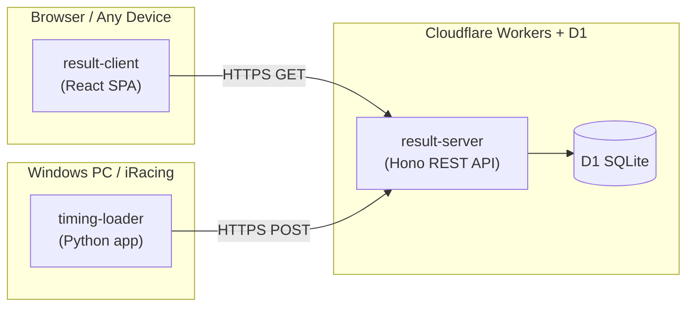

# eSM Prequal

A specialized iRacing live timing app for hotlap qualification competitions. Operators run a local timing loader alongside the iRacing simulator; results are pushed to a cloud API and displayed in real time on a web client. Hardcoded to implement eSM 2026 pre qualification heat split rules.

Official deployment at https://esm-prequal.pages.dev/

## Architecture

## Components

| Package | Language | Purpose |
|---------|----------|---------|
| [`packages/timing-loader-py`](packages/timing-loader-py/) | Python | Reads iRacing telemetry on Windows, POSTs lap time batches to the server |
| [`packages/result-server`](packages/result-server/) | TypeScript | Laptime backend, a Cloudflare Workers REST API with D1 (SQLite) storage |
| [`packages/result-client`](packages/result-client/) | TypeScript / React | Single-page app that polls the server and displays live standings |

## API

All routes are under `/api`. The POST route requires an `X-API-Key` header.

| Method | Path | Auth | Description |
|--------|------|------|-------------|
| `POST` | `/api/laptimes` | API key | Upload a batch of lap times |
| `GET` | `/api/competitions` | — | List distinct competition names |
| `GET` | `/api/drivers` | — | List all drivers, obey driver name overrides |
| `GET` | `/api/laptimes?competition=X` | — | All lap times for a competition |
| `GET` | `/api/standings?competition=X` | — | Best valid lap per driver, sorted fastest-first |

## Monorepo Layout

| Path | Description |
|------|-------------|
| `packages/timing-loader-py/` | Laptime data collector (Python, pyirsdk) |
| `packages/result-server/` | Laptime backend (TypeScript, Cloudflare Worker, D1) |
| `packages/result-client/` | Standings browser (TypeScript, React) |

Packages are independent. There is no shared workspace tooling. Dependencies are managed individually.

## Local Quick Start

1. **Start the server** — see [`packages/result-server`](packages/result-server/README.md)
2. **Start the client** — see [`packages/result-client`](packages/result-client/README.md)
3. **Run the loader on the race PC** — see [`packages/timing-loader-py`](packages/timing-loader-py/README.md)

## TODO

- Automatically close all started drives after a threshold period
- FiSRA colors, fonts
- Visually represent gap to the top with bar in the delta column background
- Predict cutoff
- Freeze results and store them in result-client repo
- Annotate server, generate OpenAPI spec, serve developer portal
- Generalize split to heats and former champion handling
